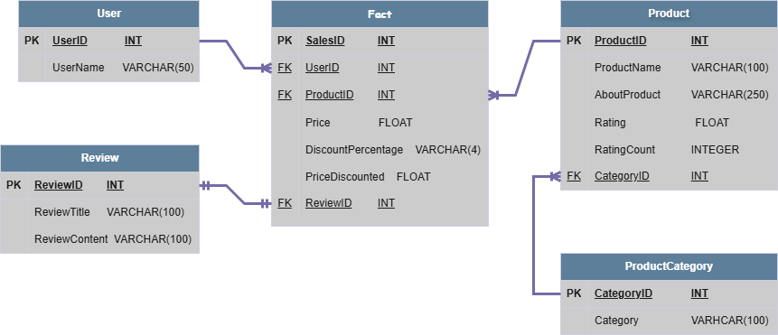

# ETL

In the next jupyter notebook, the next tasks are made:

- Change the currency from Rupees to Dollars, using the currencyapi.com api to get the currency up.
- The data is splitted into several tables to create a **Relational Model** inside a Database of MySQL using the pymysql connector from python.

